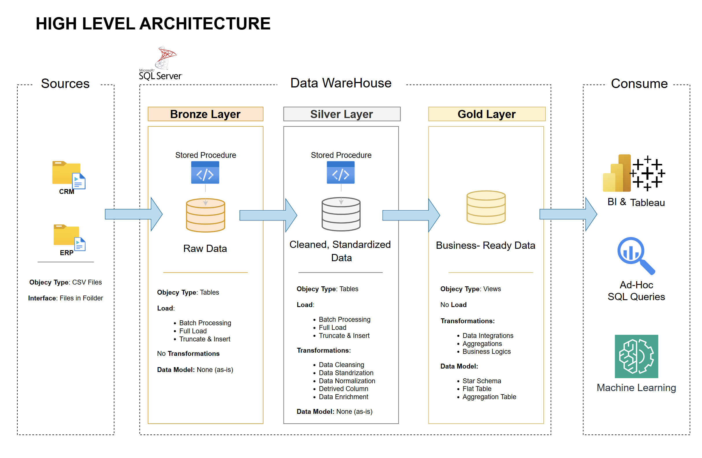

# Data Warehouse & Analytics Portfolio Project 🚀 

Welcome! This project demonstrates a comprehensive data warehousing and analytics solution, from building a data warehouse to generating actionable insights.

---
## 🏗️ Data Architecture

The warehouse is organized using the Medallion Architecture pattern, split into **Bronze**, **Silver**, and **Gold** layers:


1. **Bronze Layer**: Holds the raw, untouched data pulled straight from source systems; in this case, CSV files loaded into SQL Server.
2. **Silver Layer**: Where the data gets cleaned up cleansing, standardizing, and normalizing it so it's ready for downstream analysis.
3. **Gold Layer**: Houses business-ready data modeled into a star schema required for reporting and analytics.

---
## 📖 What's in This Project

This project covers:

1. **Data Architecture** : designing a modern warehouse Using Medallion Architecture **Bronze**, **Silver**, and **Gold** layers.
2. **ETL Pipelines**: pulling data from source systems, transforming it, and loading it into the warehouse.
3. **Data Modeling**: building out fact and dimension tables tuned for analytical querying.
4. **Analytics & Reporting**: writing SQL-based reports and dashboards that surface real insights.

---

## 🛠️ Tools & Resources

The tools listed below used in this project:
- **[Datasets](datasets/):** the raw CSV files used throughout the project.
- **[SQL Server Express](https://www.microsoft.com/en-us/sql-server/sql-server-downloads):** a lightweight option for hosting your own SQL database.
- **[SQL Server Management Studio (SSMS)](https://learn.microsoft.com/en-us/sql/ssms/download-sql-server-management-studio-ssms?view=sql-server-ver16):** the GUI for managing and querying your databases.
- **[DrawIO](https://www.drawio.com/):** for sketching out architecture diagrams, data models, and flowcharts.
---

## 🚀 Project Requirements

### Building the Warehouse (Data Engineering)

#### Goal
Build a modern SQL Server data warehouse that brings sales data together in one place, making it easier to report on and drive decisions from.

#### What That Involves
- **Data Sources**: Import data from two source systems (ERP and CRM) provided as CSV files.
- **Data Quality**: Cleanse and resolve data quality issues prior to analysis.
- **Integration**: Combine both sources into a single, user-friendly data model designed for analytical queries.
- **Scope**: Focus on the latest dataset only; historization of data is not required.
- **Documentation**: Provide clear documentation of the data model to support both business stakeholders and analytics teams.

---

### BI: Analytics & Reporting (Data Analysis)

#### Goal
Write SQL-driven analytics that surface insights around:
- **Customer Behavior**
- **Product Performance**
- **Sales Trends**

The goal is to hand stakeholders the metrics they need to make smarter, faster decisions.

See [docs/requirements.md](docs/requirements.md) for the full breakdown.

## 📂 How the Repo Is Organized
```
data-warehouse-project/
│
├── datasets/                           # Raw datasets used for the project (ERP and CRM data)
│
├── docs/                               # Project documentation and architecture details
│   ├── Architecture.drawio             # Draw.io file shows the project's architecture
│   ├── data_catalog.md                 # Catalog of datasets, including field descriptions and metadata
│   ├── data_flow.drawio                # Draw.io file for the data flow diagram
│   ├── data_models.drawio              # Draw.io file for data models (star schema)
│   ├── naming-conventions.md           # Consistent naming guidelines for tables, columns, and files
│
├── scripts/                            # SQL scripts for ETL and transformations
│   ├── bronze/                         # Scripts for extracting and loading raw data
│   ├── silver/                         # Scripts for cleaning and transforming data
│   ├── gold/                           # Scripts for creating analytical models
│
├── tests/                              # Test scripts and quality files
│
├── README.md                           # Project overview and instructions
├── LICENSE                             # License information for the repository
├── .gitignore                          # Files and directories to be ignored by Git
└── requirements.txt                    # Dependencies and requirements for the project
```

## ☕ Let's Connect

I'd love to stay connected;  find me on these platforms:

[](https://linkedin.com/in/sprobotics)

---

## 🛡️ License

Licensed under the [MIT License](LICENSE) — feel free to use, adapt, and share this project as long as you give proper credit.

## 🌟 About Me

Hi there! I'm **Sagar Patel**. I am a Patent Associate with over 1.5 years of experience and skilled in Python (Pandas, NumPy), SQL, Power BI, and Tableau for data analysis and visualization. I enjoy discovering new concepts and facing challenges.
